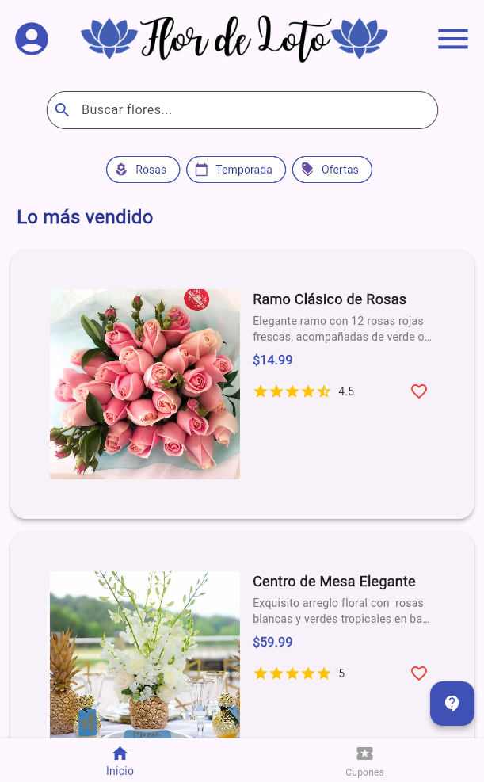
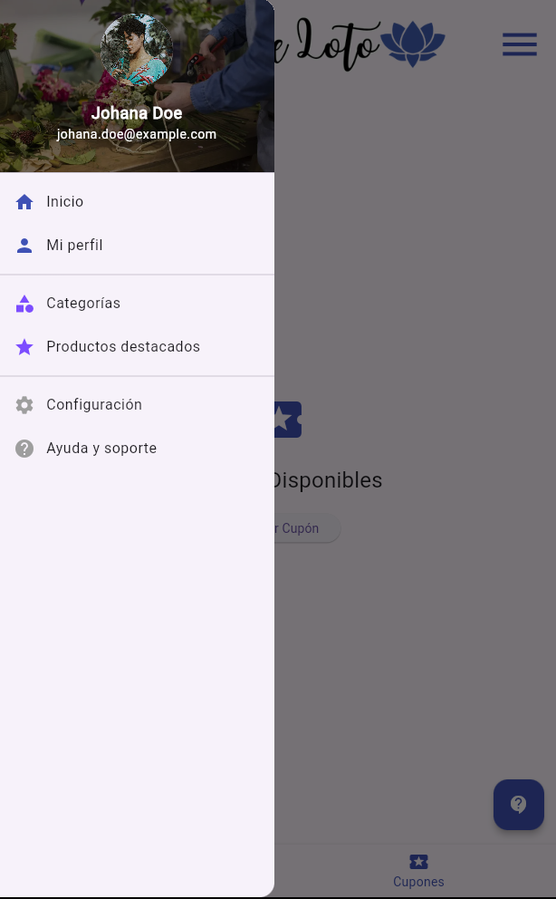

# 🌸 Loto Store - Flower Shop E-Commerce UI
<div>
  
</div>

A beautiful Flutter application for a fictional flower shop called "Loto Store". This university project features a responsive UI with product listings, user profiles, and elegant floral arrangements.

<div align="center">
  
  
</div>

## ✨ Features
- Product catalog with ratings and prices
- User profile section
- Responsive design for multiple platforms
- Clean and intuitive interface

## 🛠️ Technologies
- Flutter 3.0+
- Dart 2.17+

## 🚀 Getting Started

### Prerequisites
- Flutter SDK installed
- IDE (VS Code or Android Studio recommended)

### 💻 Installation
   1. Clone the repository:
   ```bash
   git clone https://github.com/jazjv04/loto-store.git
   cd loto-store
   ```
   
   2. Install dependencies:
 ```bash
    flutter pub get
 ```

   3. Run the app:
 ```bash
    flutter run
 ```

